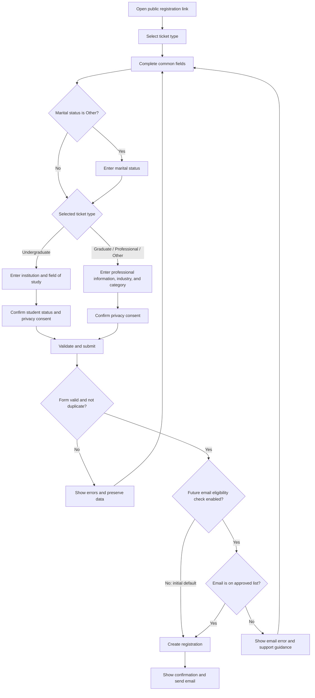

# NGM Conference 5.0 Sponsored Ticket Registration Plan

## 1. Purpose

This document defines the product requirements and technical implementation plan for a single conference registration page for recipients of sponsored or complimentary NGM Conference 5.0 tickets.

The form will collect attendee data for two ticket categories:

1. **Undergraduates**
2. **Graduates / Professionals / Others**

A registrant will use one page and one form. Selecting a ticket type will dynamically determine which category-specific fields are displayed and validated. Common fields will remain the same for both categories.

The registration workflow is separate from paid ticket checkout and from the existing competition application workflows.

## 2. Goals and Success Criteria

### 2.1 Goals

1. Collect complete, structured attendee data from sponsored/free-ticket recipients.
2. Present one responsive form rather than maintaining separate registration pages.
3. Show only fields relevant to the selected ticket category.
4. Prevent duplicate or accidental registrations and support future email eligibility enforcement against the sponsored/discounted attendee list.
5. Give the attendee an immediate confirmation and a durable registration reference.
6. Allow authorized administrators to search, filter, inspect, and export registrations.
7. Protect personal data and provide clear consent and privacy information.

### 2.2 Success Criteria

1. Any prospective attendee with the public registration link can complete registration on mobile or desktop while eligibility enforcement is disabled.
2. Changing the ticket type immediately changes the category-specific fields.
3. Hidden category fields are neither required nor submitted.
4. Invalid or incomplete submissions show accessible, field-level errors.
5. A valid submission creates exactly one database record, even if the submit button is clicked more than once.
6. Duplicate email usage returns a clear, non-destructive message.
7. A confirmation email is sent after the database transaction succeeds.
8. Administrators can export the exact fields collected for both categories.

## 3. Scope

### 3.1 In Scope

1. Public registration page for sponsored/free ticket recipients.
2. Ticket type selection and dynamic fields.
3. Client-side and server-side validation.
4. Public access without invitation tokens or sponsor codes.
5. A prepared, disabled-by-default server check against a sponsored/discounted attendee email array.
6. Registration persistence in PostgreSQL through Prisma.
7. Duplicate prevention and rate limiting.
8. Registration success state/page.
9. Confirmation email.
10. Admin registration list, detail view, filters, and CSV/Excel export.
11. Responsive design, accessibility, error states, and analytics events.

### 3.2 Out of Scope

1. Paid ticket checkout and payment processing.
2. Competition applications.
3. Seat selection.
4. Event-day QR scanning or badge printing, unless separately approved.
5. Attendee self-service editing or cancellation after submission.
6. Sponsor billing or sponsorship package management.

## 4. User Roles and Entry Conditions

### 4.1 Sponsored Attendee

A person who has received a free or sponsored ticket and must provide attendee details before the ticket is confirmed.

### 4.2 Administrator

An authenticated user with the existing `ADMIN` role who can review and export registrations.

### 4.3 Public Access Rule

The registration page must be publicly accessible at `/register`. It must not require an invitation token, sponsor code, attendee login, or email pre-verification before displaying the form.

For the initial release:

1. Anyone with the registration link can open and submit the form.
2. The attendee selects either ticket type and completes the corresponding fields.
3. The server performs normal schema validation, duplicate checks, and rate limiting.
4. The server does **not** enforce the sponsored/discounted attendee email list.
5. A valid, non-duplicate submission is stored and confirmed.

### 4.4 Deferred Email Eligibility Rule

The organization already has a list of people who received discounted or sponsored tickets. The approved email addresses will be represented as a server-only array and used as an email allowlist. No dedicated database table or admin import workflow is required.

When this rule is enabled:

1. The registration page remains public and the full form remains available to everyone.
2. The server normalizes the submitted email after the attendee submits the form.
3. The server checks whether the normalized email is included in the eligibility array before creating a registration.
4. If the email is present, registration continues normally.
5. If the email is absent, no registration is created and the API returns a field-level email error plus this form-level message:

> We couldn't verify this email against the sponsored or discounted ticket list. Please check the email and register again, or contact the NGM Conference support team for assistance.

The eligibility call site must be present but commented out for the initial release, with a clear `TODO` explaining that it should be enabled only after the email array has been populated and verified. A configuration flag is safer for later rollout and should replace the commented call before production enforcement is activated.

## 5. End-to-End User Flow

### 5.1 Form and Registration Flow Diagram



The **common fields** node includes first name, last name, email, confirm email, phone number, gender, marital status, residential address, activity of interest, discovery source, and optional referral information.

### 5.2 Public Registration Flow

1. The attendee opens the public `/register` URL.
2. The page displays the event title, date, sponsored/discounted-ticket explanation, and registration form without an access gate.
3. The attendee selects one of the following:
   - Undergraduate
   - Graduate / Professional / Other
4. Common fields appear for both ticket types.
5. Category-specific fields appear after ticket selection.
6. The attendee completes required fields and accepts required declarations/consents.
7. The client validates the form.
8. The client submits the complete payload to `POST /api/registrations`.
9. The server validates the payload, checks duplicates, and creates the registration.
10. The attendee is redirected to `/register/success?reference=<publicReference>` or shown an equivalent success state.
11. The system sends a confirmation email containing the attendee name, ticket category, event information, and registration reference.

### 5.3 Future Ineligible Email Flow

This flow is inactive for the initial public release. After the allowlist condition is enabled:

1. The attendee completes and submits the public form normally.
2. The server normalizes the submitted email and checks membership in the eligibility array.
3. If the normalized email is not in the array, the server returns HTTP `403` with error code `EMAIL_NOT_ELIGIBLE`.
4. The UI attaches an error to the email field and displays the support/re-registration message from Section 4.4.
5. The attendee's entered values remain available for correction.
6. No registration record or confirmation email is created.

### 5.4 Duplicate Registration Flow

1. A normalized email address must not register more than once for Conference 5.0.
2. The API returns HTTP `409` with a user-friendly message.
3. The existing registration is not modified.
4. Repeated requests carrying the same idempotency key return the original successful result rather than creating another registration.

### 5.5 Ticket Type Change Flow

1. The attendee may freely change ticket type before submission.
2. The UI displays a warning before clearing category-specific values already entered.
3. On confirmation, fields belonging to the previous category are unregistered and removed from the form payload.
4. Common fields remain unchanged.
5. Validation immediately switches to the selected category schema.

## 6. Form Requirements

### 6.1 Ticket Type Selector

| Field | API key | Type | Required | Options / Rules |
|---|---|---:|:---:|---|
| Ticket Type | `ticketType` | Radio cards or select | Yes | `UNDERGRADUATE`, `GRADUATE_PROFESSIONAL` |

Use visible radio cards rather than a visually ambiguous dropdown where space permits. Each option should include a short explanation. The control must use a `fieldset` and `legend`, expose checked state to assistive technology, and be keyboard operable.

The user-facing second label may remain **“Graduates / Professionals / Others”**, while the internal enum should remain stable if copy changes later.

### 6.2 Common Fields

| Field | API key | Input type | Required | Validation / Behavior |
|---|---|---:|:---:|---|
| First Name | `firstName` | Text | Yes | Trim; 2–80 characters; letters, spaces, apostrophes, and hyphens allowed |
| Last Name | `lastName` | Text | Yes | Trim; 2–80 characters; same name rules as first name |
| Email Address | `email` | Email | Yes | Trim, lowercase, valid email, maximum 254 characters |
| Confirm Email | `confirmEmail` | Email | Yes | Must match `email`; validation-only and must not be persisted |
| Phone Number | `phoneNumber` | Telephone | Yes | International format with country code; normalize to E.164 when possible |
| Gender | `gender` | Select | Yes | `male` or `female` only |
| Marital Status | `maritalStatus` | Select | Yes | `single`, `married`, or `other` |
| Other Marital Status | `maritalStatusOther` | Text | Conditional | Hidden and disabled unless `maritalStatus === "other"`; then required, trimmed, and limited to 60 characters |
| Residential Address | `residentialAddress` | Textarea | Yes | Trim; 10–300 characters; autocomplete `street-address` |
| Activity of Interest | `activityOfInterest` | Select | Yes | Select exactly one approved activity from Section 7.3 |
| How Did You Hear About NGM Conference? | `discoverySource` | Select | Yes | Select one approved source from Section 7.4 |
| Referral Code/Name | `referral` | Text | No | Trim; maximum 100 characters; terminology must be confirmed |
| Privacy Consent | `privacyConsent` | Checkbox | Yes | Must be `true`; include links to privacy notice and terms |

Activities of Interest is a single-select dropdown. Use the label **“Which activity interests you most?”** so the wording accurately communicates that only one option may be selected.

### 6.3 Undergraduate-Only Fields

These fields are displayed and validated only when `ticketType === "UNDERGRADUATE"`.

| Field | API key | Input type | Required | Validation / Behavior |
|---|---|---:|:---:|---|
| University/Institution Name | `undergraduate.institutionName` | Text | Yes | Trim; 2–150 characters |
| Field of Study/Major | `undergraduate.fieldOfStudy` | Text | Yes | Trim; 2–120 characters |
| Student Status Declaration | `undergraduate.studentStatusConfirmed` | Checkbox | Yes | Must be `true` |

Recommended declaration copy:

> I confirm that I am currently an undergraduate student and will provide valid proof of student status on the conference day. I understand that my sponsored ticket may be cancelled if I cannot provide proof.

The original screenshot wording mentions termination “without refund,” which is not applicable to a free ticket and should be replaced with the clearer copy above.

### 6.4 Graduate / Professional / Other-Only Fields

These fields are displayed and validated only when `ticketType === "GRADUATE_PROFESSIONAL"`.

| Field | API key | Input type | Required | Validation / Behavior |
|---|---|---:|:---:|---|
| Professional Information | `professional.professionalInformation` | Text | Yes per screenshot | Trim; 2–200 characters; helper text should request current role and organization or current status |
| Industry Sector | `professional.industrySector` | Select | Yes | Approved options listed in Section 7 |
| Professional Category | `professional.professionalCategory` | Select | Yes | Approved options listed in Section 7 |

“Professional Information” is too broad for consistent reporting. Before implementation, product should either:

1. Rename it to **“Current Role and Organization”** and retain one text field; or
2. Split it into `jobTitle` and `organizationName`, with organization optional for recent graduates, unemployed attendees, and “Other.”

Option 2 is recommended for cleaner admin filtering and exports.

### 6.5 Submission Controls

1. Primary action: **Complete Registration**.
2. Disable the submit button while a request is in flight.
3. Show a loading indicator and non-changing accessible button label.
4. Keep entered data when the API returns a validation, conflict, or temporary server error.
5. Display a form-level error summary linked to invalid fields.
6. Move focus to the first invalid field after failed validation.
7. Do not allow Enter key presses inside ordinary fields to cause repeated submissions.
8. Include an idempotency key with every submission attempt.

## 7. Proposed Dropdown Values

All option values should be centralized in `lib/constants/registration.ts`, stored as stable machine-readable values, and rendered with user-friendly labels.

### 7.1 Gender

Approved values:

1. `male` — Male
2. `female` — Female

### 7.2 Marital Status

Approved values:

1. `single` — Single
2. `married` — Married
3. `other` — Other

Selecting `other` must enable and display the `maritalStatusOther` text field. The field becomes required while `other` is selected. Selecting `single` or `married` must clear, disable, unregister, and exclude `maritalStatusOther` from the submitted payload.

Marital status is sensitive personal information. Although it is required by the supplied form requirements, the privacy notice must explain why it is collected and who can access it.

### 7.3 Activities of Interest

Approved single-select values:

1. `startup_pitch_competition` — Startup Pitch Competition
2. `panel_discussions` — Panel Discussions
3. `workshops_skill_sessions` — Workshops/Skill Sessions
4. `networking_sessions` — Networking Sessions
5. `one_on_one_mentorship` — One-on-One Mentorship

### 7.4 Discovery Source

Approved values:

1. `social_media` — Social Media (Instagram/Twitter/LinkedIn)
2. `referral_friend` — Referral/Friend
3. `email_newsletter` — Email Newsletter
4. `school_campus_representative` — School/Campus Representative
5. `other` — Other

When `other` is selected, display and enable a `discoverySourceOther` text field. It is required while `other` is selected. Choosing another source must clear, disable, unregister, and exclude `discoverySourceOther` from the submitted payload.

### 7.5 Industry Sector

Proposed values:

1. Technology
2. Financial Services / Fintech
3. Education
4. Healthcare
5. Agriculture
6. Energy / Utilities
7. Manufacturing
8. Retail / E-commerce
9. Media / Creative Industries
10. Professional Services
11. Government / Public Sector
12. Nonprofit / Social Impact
13. Construction / Real Estate
14. Transportation / Logistics
15. Hospitality / Tourism
16. Student / Not Yet in Industry
17. Other

### 7.6 Professional Category

Proposed values:

1. Recent Graduate
2. Entry-Level Professional
3. Mid-Level Professional
4. Senior Professional / Executive
5. Entrepreneur / Business Owner
6. Freelancer / Self-Employed
7. Public Servant
8. Academic / Researcher
9. Job Seeker / Between Roles
10. Other

## 8. UX, Responsive Design, and Accessibility

### 8.1 Page Structure

1. Use route `/register` for the form and `/register/success` for confirmation.
2. Keep the route in `app/(main)` so it inherits the public conference layout.
3. Show a concise page header with event date and an explanation that the form is for sponsored/free-ticket recipients.
4. Use one card/container for the form, matching the screenshots and the existing NGM blue/green design system.
5. Use a two-column grid at desktop widths and one column on mobile.
6. Keep the ticket selector above all attendee fields.
7. Group fields under visible headings: **Ticket Type**, **Personal Information**, **Interests**, and **Education** or **Professional Information**.

### 8.2 Dynamic Rendering

1. Initially show the ticket type selector and common introductory copy.
2. Render category fields only after a ticket type is selected.
3. Animate category transitions only when `prefers-reduced-motion` permits.
4. Do not use animation that delays keyboard access or form submission.
5. Preserve common field values when ticket type changes.
6. Clear and unregister hidden category fields to avoid stale data submission.

### 8.3 Accessibility

1. Use native `<label>`, `<input>`, `<select>`, `<textarea>`, `<fieldset>`, and `<legend>` semantics.
2. Associate help text and errors through `aria-describedby`.
3. Set `aria-invalid` on invalid controls.
4. Announce API and validation errors in an `aria-live="polite"` region.
5. Ensure all interactive controls have visible focus indicators.
6. Do not communicate required state or errors by color alone.
7. Maintain WCAG 2.2 AA color contrast.
8. Ensure the full flow works with keyboard-only navigation and common screen readers.
9. Use appropriate autocomplete attributes such as `given-name`, `family-name`, `email`, `tel`, `organization`, and `street-address`.

## 9. Client-Side Architecture

### 9.1 Proposed Files

```text
app/
└── (main)/
    └── register/
        ├── page.tsx
        └── success/
            └── page.tsx

components/
└── registration/
    ├── ConferenceRegistrationForm.tsx
    ├── TicketTypeSelector.tsx
    ├── CommonFields.tsx
    ├── UndergraduateFields.tsx
    ├── ProfessionalFields.tsx
    ├── RegistrationSubmitButton.tsx
    ├── RegistrationErrorSummary.tsx
    └── RegistrationSuccess.tsx

hooks/
└── useConferenceRegistration.ts

lib/
├── api/
│   └── registrations.ts
├── constants/
│   └── registration.ts
└── schemas/
    └── registration.ts

types/
└── registration.ts
```

### 9.2 Component Boundaries

1. `page.tsx` should remain a Server Component responsible for page metadata and composing the client form; it must not perform an invitation preflight.
2. `ConferenceRegistrationForm.tsx` should be a focused Client Component because it owns React Hook Form state and dynamic interactions.
3. Field groups should be presentational components that receive React Hook Form registration/control/error props.
4. `useConferenceRegistration.ts` should encapsulate form defaults, submission state, ticket-switch behavior, and success/error handling.
5. `lib/api/registrations.ts` should contain the typed client request function rather than embedding `fetch` calls in components.

### 9.3 Form State

Use `react-hook-form` with `zodResolver` and `shouldUnregister: true` so hidden category fields are removed automatically.

Recommended defaults:

```ts
useForm<ConferenceRegistrationInput>({
  resolver: zodResolver(conferenceRegistrationSchema),
  shouldUnregister: true,
  mode: "onBlur",
  defaultValues: {
    ticketType: undefined,
    firstName: "",
    lastName: "",
    email: "",
    confirmEmail: "",
    phoneNumber: "",
    maritalStatus: undefined,
    maritalStatusOther: "",
    activityOfInterest: undefined,
    discoverySource: undefined,
    discoverySourceOther: "",
    referral: "",
    privacyConsent: false,
  },
});
```

Use `watch("ticketType")` or `useWatch` only at the nearest component that needs the selected type to avoid unnecessary rerenders.

### 9.4 Mutation Handling

Project guidance calls for React Query mutation hooks, but `@tanstack/react-query` is not currently installed or configured. Before implementation, choose one of these approaches:

1. **Preferred project-standard approach:** add `@tanstack/react-query`, configure a single `QueryClientProvider` in `app/providers.tsx`, and expose `useCreateConferenceRegistration()` as a custom mutation hook.
2. **Minimal-dependency approach:** follow the current contact/competition pattern with a typed fetcher and local mutation state in `useConferenceRegistration`.

Do not introduce React Query solely inside this feature without adding the shared provider and a consistent project-level pattern.

## 10. Validation and Type Design

### 10.1 Discriminated Union

Use a Zod discriminated union on `ticketType`. This guarantees that undergraduate data cannot be accepted for a professional registration and vice versa.

```ts
const commonSchema = z.object({
  firstName: nameSchema,
  lastName: nameSchema,
  email: z.string().trim().toLowerCase().email().max(254),
  confirmEmail: z.string().trim().toLowerCase().email().max(254),
  phoneNumber: phoneSchema,
  gender: genderSchema,
  maritalStatus: maritalStatusSchema,
  maritalStatusOther: z.string().trim().max(60).optional(),
  residentialAddress: z.string().trim().min(10).max(300),
  activityOfInterest: activitySchema,
  discoverySource: discoverySourceSchema,
  discoverySourceOther: z.string().trim().max(100).optional(),
  referral: z.string().trim().max(100).optional(),
  privacyConsent: z.literal(true),
  idempotencyKey: z.string().uuid(),
});

const conferenceRegistrationSchema = z.discriminatedUnion("ticketType", [
  commonSchema.extend({
    ticketType: z.literal("UNDERGRADUATE"),
    undergraduate: undergraduateSchema,
  }),
  commonSchema.extend({
    ticketType: z.literal("GRADUATE_PROFESSIONAL"),
    professional: professionalSchema,
  }),
]);
```

Add object-level refinements for:

1. `email === confirmEmail`.
2. `maritalStatusOther` is present when marital status is `other` and absent for all other statuses.
3. `discoverySourceOther` is present when discovery source is `other` and absent for all other sources.
4. The undergraduate declaration is `true` for undergraduate registrations.

### 10.2 Client and Server Validation

1. Reuse one shared Zod schema on client and server.
2. Treat server validation as authoritative.
3. Return field errors in a stable structure suitable for `react-hook-form`'s `setError`.
4. Never persist `confirmEmail` or the raw idempotency key as attendee profile fields.
5. Normalize email and phone before duplicate checks and persistence.
6. Reject unknown object keys or strip them explicitly to avoid storing unapproved data.

## 11. Database Design

### 11.1 New Enum

```prisma
enum ConferenceTicketType {
  UNDERGRADUATE
  GRADUATE_PROFESSIONAL
}
```

### 11.2 Registration Model

A dedicated relational model is recommended instead of reusing the competition `Application` model. Registrations have different lifecycle, reporting, validation, and privacy requirements.

```prisma
model ConferenceRegistration {
  id                       String               @id @default(cuid())
  publicReference          String               @unique
  ticketType               ConferenceTicketType
  firstName                String
  lastName                 String
  email                    String
  normalizedEmail          String               @unique
  phoneNumber              String
  gender                   String
  maritalStatus            String
  maritalStatusOther       String?
  residentialAddress       String
  activityOfInterest       String
  discoverySource          String
  discoverySourceOther     String?
  referral                 String?
  institutionName          String?
  fieldOfStudy             String?
  studentStatusConfirmed   Boolean?
  professionalInformation  String?
  industrySector           String?
  professionalCategory     String?
  privacyConsentAt         DateTime
  privacyNoticeVersion     String
  submissionKeyHash        String               @unique
  createdAt                DateTime              @default(now())
  updatedAt                DateTime              @updatedAt

  @@index([ticketType])
  @@index([createdAt])
  @@index([discoverySource])
}
```

The database cannot fully express category-dependent required fields with Prisma alone. Enforce those invariants in Zod and API tests. Optionally add PostgreSQL check constraints in a custom migration if the team is comfortable maintaining SQL-level constraints.

If multiple conference editions will share the database, add an `Event` model or at minimum an `eventCode` column and use `@@unique([eventCode, normalizedEmail])` rather than a globally unique email.

### 11.3 Server-Only Eligibility Array

Do not create a Prisma model or database table for the sponsored/discounted attendee filter list. Store the approved emails in a server-only module such as `lib/constants/registration-eligibility.ts`:

```ts
import "server-only";

export const SPONSORED_ATTENDEE_EMAILS: readonly string[] = [
  "attendee.one@example.com",
  "attendee.two@example.com",
];
```

Array requirements:

1. Store every email in trimmed lowercase form.
2. Match only against a similarly normalized submitted email.
3. Deduplicate the array before deployment.
4. Keep the module server-only and never import it into a Client Component.
5. Do not expose the array through a public or admin API.
6. Update the array through a reviewed code change when recipients are added or removed.
7. Because the array contains personal data, restrict repository access and do not print its contents in logs, errors, builds, or analytics.

Use `SPONSORED_ATTENDEE_EMAILS.includes(normalizedEmail)` for the planned filter check. The filter source remains the array; no database lookup is performed.

### 11.4 Data Migration

1. Add the new enum and `ConferenceRegistration` model in one Prisma migration.
2. Generate the Prisma client with `pnpm db:generate`.
3. Add the normalized email array in the server-only constants module; no eligibility-table migration or data import is needed.
4. Do not alter existing competition application records.

## 12. API Design

### 12.1 Deferred Eligibility Check

There is no public eligibility lookup endpoint and no preflight request. The server-only email array must be checked only inside `POST /api/registrations` so the application does not expose whether an email belongs to the sponsored/discounted attendee list.

The initial implementation should include an eligibility lookup helper, but its call site must remain commented out until enforcement is approved:

```ts
// TODO: Enable after SPONSORED_ATTENDEE_EMAILS is populated,
// verified, and ready for production enforcement.
// if (!SPONSORED_ATTENDEE_EMAILS.includes(normalizedEmail)) {
//   return emailNotEligibleResponse();
// }
```

While this block is commented out, all otherwise valid, non-duplicate submissions are accepted. Before enforcement is enabled, replace this temporary commented block with an environment-backed feature flag such as `ENFORCE_REGISTRATION_ELIGIBILITY=true` so activation and rollback do not require editing business logic.

### 12.2 Create Registration

`POST /api/registrations`

Request shape:

```json
{
  "formData": {
    "ticketType": "UNDERGRADUATE",
    "firstName": "Ada",
    "lastName": "Okafor",
    "email": "ada@example.com",
    "confirmEmail": "ada@example.com",
    "phoneNumber": "+2348000000000",
    "gender": "female",
    "maritalStatus": "single",
    "residentialAddress": "Example address, Lagos",
    "activityOfInterest": "panel_discussions",
    "discoverySource": "referral_friend",
    "referral": "SPONSOR-001",
    "privacyConsent": true,
    "undergraduate": {
      "institutionName": "Example University",
      "fieldOfStudy": "Computer Science",
      "studentStatusConfirmed": true
    },
    "idempotencyKey": "uuid"
  }
}
```

Successful response: HTTP `201`

```json
{
  "success": true,
  "registrationId": "internal-cuid",
  "publicReference": "NGM5-ABC12345",
  "message": "Registration completed successfully."
}
```

Error responses:

| Status | Meaning | Client behavior |
|---:|---|---|
| `400` | Invalid payload | Map field errors and show summary |
| `403` | Email is not on the eligibility list when future enforcement is enabled | Mark email invalid, preserve the form, and show support/re-registration guidance |
| `409` | Email is already registered | Preserve form and show duplicate message |
| `429` | Rate limit exceeded | Ask user to retry later |
| `500` | Unexpected server failure before commit | Preserve form and show retry message |

An email-provider failure after the registration transaction commits must not change the successful HTTP response into an error. The server should return `201`, record the delivery failure, and retry asynchronously where possible so the attendee is not encouraged to submit again.

### 12.3 Server Transaction

The POST handler should perform the following in order:

1. Parse JSON safely and enforce a request-size limit.
2. Apply registration-specific IP rate limiting.
3. Validate with the shared Zod schema.
4. Normalize email and phone.
5. Run the future eligibility array membership check only when its enforcement condition is enabled; leave this condition commented out for the initial release.
6. Return `403 EMAIL_NOT_ELIGIBLE` before persistence when enforcement is enabled and the normalized email is not in the array.
7. Start a Prisma transaction.
8. Recheck duplicate and idempotency constraints inside the transaction.
9. Create `ConferenceRegistration`.
10. Commit the transaction.
11. Log the registration ID and ticket type without logging full personal data.
12. Send the confirmation email after commit.
13. Return HTTP `201` even if email delivery fails; log and retry email separately where possible.

Database uniqueness constraints are the final defense against race-condition duplicates. Do not rely only on a pre-insert `findFirst` call.

### 12.4 Admin APIs

Recommended endpoints:

1. `GET /api/admin/registrations` — paginated list, search, filters, and export mode.
2. `GET /api/admin/registrations/[id]` — registration detail.

No eligibility-list API is required because the filter list is maintained as a server-only array.

All routes under `/api/admin` will inherit the existing middleware protection and must still enforce authorization at the route/service layer where practical.

## 13. Admin and Reporting Requirements

### 13.1 Registration List

Add `/admin/registrations` as a distinct page rather than mixing attendees with competition applications.

Columns:

1. Attendee name
2. Email
3. Phone number
4. Ticket type
5. Institution or organization/status summary
6. Registration date
7. Registration reference

Filters:

1. Ticket type
2. Industry sector
3. Professional category
4. Institution
5. Discovery source
6. Registration date range

Search should support name, normalized email, phone number, and public reference. Debounce search input and validate pagination/filter query parameters server-side.

### 13.2 Registration Detail

Display:

1. Common attendee information.
2. Only the selected category's fields.
3. Consent timestamp.
4. Registration timestamps and public reference.

Sensitive fields should not be included in client logs or analytics.

### 13.3 Export

1. Support CSV and Excel using the project's existing `xlsx` dependency and export conventions.
2. Add dedicated registration field labels rather than overloading competition application labels.
3. Export one row per attendee.
4. Export the selected `activityOfInterest` using its user-facing label.
5. Include `maritalStatusOther` and `discoverySourceOther` only when applicable.
6. Exclude idempotency values; the eligibility array must never be included in exports.
7. Record or log exports if audit requirements are introduced.

## 14. Security, Privacy, and Reliability

### 14.1 Security

1. Keep `/register` public while protecting submission with an independent `registrationRatelimit`; do not share the competition prefix.
2. Validate and normalize every field on the server.
3. Reject unexpected ticket types and option values.
4. Perform any future eligibility check only on the server; do not expose a public email-lookup endpoint.
5. Keep the eligibility array in a module marked with `server-only` and do not import it into client code.
6. Prevent eligibility probing with rate limiting and a generic `EMAIL_NOT_ELIGIBLE` response.
7. Protect admin routes with NextAuth and the existing `ADMIN` role.
8. Avoid logging names, addresses, email addresses, phone numbers, eligibility-array contents, or complete request bodies.
9. Use generic public errors and detailed structured server logs.

### 14.2 Privacy

1. Add a clear privacy notice stating why attendee data is collected and how it will be used.
2. Collect only operationally necessary fields.
3. Reassess whether marital status is required.
4. Record consent timestamp and privacy notice version.
5. Define who can access attendee exports.
6. Define a retention period and deletion/anonymization process after the event.
7. Do not send attendee data to analytics providers.
8. Do not include residential addresses in general list views; reserve them for detail views with a valid operational need.

### 14.3 Reliability

1. Use database uniqueness constraints and a transaction for registration creation and idempotency.
2. Use an idempotency key to make retries safe.
3. Treat email as a post-commit side effect.
4. If reliable delivery is critical, introduce an outbox table or background job instead of sending email inline.
5. Return stable machine-readable error codes in addition to user-facing messages.

## 15. Email and Success Experience

### 15.1 Confirmation Email

Create a React Email template in `emails/` containing:

1. Attendee first name.
2. Confirmation that the sponsored ticket registration was received.
3. Ticket category.
4. NGM Conference 5.0 date and Lagos location information once finalized.
5. Public registration reference.
6. Reminder about undergraduate proof, when applicable.
7. Contact/support details.
8. A link to conference support for corrections or eligibility questions.

### 15.2 Success Page

The success page should:

1. Confirm completion without rendering the full submitted profile.
2. Show the public registration reference.
3. Explain that a confirmation email has been sent.
4. Show the undergraduate proof reminder only for undergraduate attendees.
5. Provide a link back to the conference homepage.
6. Prevent accidental resubmission on refresh.
7. Use `noindex` metadata and avoid placing personal information in URL query parameters.

## 16. Analytics and Observability

Track only non-sensitive funnel events:

1. `registration_page_viewed`
2. `registration_ticket_type_selected`
3. `registration_submission_started`
4. `registration_submission_succeeded`
5. `registration_submission_failed`

Allowed event properties include ticket type and broad error code. Do not send names, emails, phone numbers, residential addresses, referral text, eligibility status/list data, or free-text professional/education data.

Structured server logs should include:

1. Request/correlation ID
2. Registration ID after creation
3. Ticket type
4. Result/error code
5. Duration

## 17. Testing Strategy

### 17.1 Schema Unit Tests

Test:

1. Valid undergraduate payload.
2. Valid graduate/professional payload.
3. Email mismatch.
4. Invalid phone number.
5. Missing activity selection.
6. Marital status `other` without `maritalStatusOther`.
7. Non-`other` marital status containing stale `maritalStatusOther` data.
8. Discovery source `other` without `discoverySourceOther`.
9. Non-`other` discovery source containing stale `discoverySourceOther` data.
10. Missing undergraduate declaration.
11. Undergraduate payload containing professional fields.
12. Professional payload containing undergraduate fields.
13. Unknown dropdown values.
14. Leading/trailing whitespace normalization.

### 17.2 Component Tests

Test:

1. Ticket selection displays the correct field group.
2. Changing ticket type clears the previous category's values after confirmation.
3. Selecting marital status `other` enables its required text field; changing away clears and unregisters it.
4. Selecting discovery source `other` enables its required text field; changing away clears and unregisters it.
5. Both ticket types remain selectable on the public form.
6. Required and API errors are associated with their controls.
7. Submit is disabled while pending.
8. Keyboard navigation and focus-to-error behavior.
9. Mobile single-column and desktop two-column layouts.

### 17.3 API Integration Tests

Test:

1. A valid public registration returns `201` while eligibility enforcement is disabled.
2. An email absent from the eligibility array is still accepted while enforcement is disabled.
3. An email included in the array returns `201` when enforcement is enabled.
4. An email absent from the array returns `403 EMAIL_NOT_ELIGIBLE` when enforcement is enabled.
5. Eligibility rejection creates no registration and sends no confirmation email.
6. Duplicate normalized email returns `409`.
7. Concurrent submissions create one registration.
8. Same idempotency key returns the same result.
9. Rate limit returns `429`.
10. Invalid payload returns structured field errors.
11. Email failure does not roll back a committed registration.
12. Logs do not contain raw personal data or eligibility-array contents.

### 17.4 End-to-End Tests

Test the full public-registration flow for both ticket types on desktop and mobile viewports. Cover both disabled and enabled eligibility modes, the support error for an unlisted email, success email behavior in a test environment, and admin export visibility.

### 17.5 Validation Commands

After implementation, run:

```bash
pnpm lint
pnpm build
```

Also run the project's chosen unit/integration/E2E test commands once a test runner is configured.

## 18. Implementation Phases

### 18.1 Phase 1 — Product Decisions and Design

1. Confirm final industry-sector and professional-category values.
2. Clarify “Referral name” versus “Referral code.”
3. Resolve “Professional Information” as one field or role plus organization.
4. Confirm who owns and reviews updates to the eligibility email array.
5. Confirm when email eligibility enforcement will be enabled.
6. Approve privacy consent language and retention period.
7. Produce mobile, desktop, loading, eligibility-error, general-error, and success designs.

### 18.2 Phase 2 — Data and Server Foundation

1. Add the Prisma enum and `ConferenceRegistration` model.
2. Add and apply the registration migration.
3. Add registration constants, the server-only eligibility email array, and the shared Zod schema.
4. Implement email normalization and array-membership utilities.
5. Implement the public registration POST route with the eligibility condition present but commented out by default.
6. Add rate limiting, duplicate constraints, idempotency, logging, and tests.
7. Replace the temporary commented eligibility condition with a disabled environment-backed feature flag before enabling enforcement.

### 18.3 Phase 3 — Registration UI

1. Add `/register` and `/register/success` routes.
2. Build reusable field components and ticket selector.
3. Implement React Hook Form discriminated flow.
4. Add client API/mutation hook.
5. Add accessible validation and API errors.
6. Add responsive styling and reduced-motion behavior.
7. Add confirmation email template.

### 18.4 Phase 4 — Administration

1. Add the registration list and detail page.
2. Add filters, search, pagination, and export.
3. Add registration counts to the admin dashboard without mixing them with competition application totals.
4. Verify role protection and privacy-safe display.

### 18.5 Phase 5 — Quality Assurance and Launch

1. Complete schema, component, API, and E2E tests.
2. Run accessibility checks and keyboard/screen-reader review.
3. Verify database backup and rollback procedures.
4. Test eligibility-array matching and representative sponsored/discounted attendee flows.
5. Verify email deliverability and sender configuration.
6. Run `pnpm lint` and `pnpm build`.
7. Deploy to staging, complete stakeholder acceptance testing, then deploy to production.
8. Monitor completion rate, API failures, duplicate conflicts, and email failures after launch.

## 19. Acceptance Criteria

The feature is complete when:

1. One `/register` page supports both ticket categories.
2. Ticket category determines visible and required fields.
3. Hidden category fields are excluded from submitted and stored data.
4. All screenshot fields are represented, subject to approved privacy/product changes.
5. Client and server use the same discriminated Zod schema.
6. `/register` is public and requires no invitation token, sponsor code, or attendee login.
7. Eligibility enforcement is disabled by default, and unlisted emails are accepted in that mode.
8. The future server-side eligibility check is implemented but commented out with a clear enablement `TODO`.
9. When enabled, the check accepts emails included in the array and rejects emails absent from it with support/re-registration guidance.
10. Duplicate and concurrent submissions cannot create multiple registrations.
11. Confirmation is shown and emailed without exposing personal data in the URL.
12. The form meets responsive and WCAG 2.2 AA requirements.
13. Admins can list, search, filter, inspect, and export registrations; the eligibility array is not exposed in admin UI or APIs.
14. Personal and eligibility-array data is excluded from analytics and routine logs.
15. Schema, API, component, and end-to-end tests cover both dynamic flows and both eligibility modes.
16. `pnpm lint` and `pnpm build` pass.

## 20. Open Product Decisions

The following decisions must be approved before implementation is considered final:

1. Who owns approval and reviewed code updates for the eligibility email array?
2. When should server-side email eligibility enforcement be enabled?
3. Does “Referral name” mean a person's name, sponsor name, or referral code?
4. Should “Professional Information” be split into job title and organization?
5. What are the final industry-sector and professional-category options?
6. Is proof of undergraduate status collected only at the event, or uploaded during registration?
7. What is the attendee-data retention period?
8. Who is permitted to export residential addresses and other sensitive fields?
9. Should attendees be able to edit their registration after submission?
10. Are QR codes, badge IDs, or event-day check-in part of a later phase?
